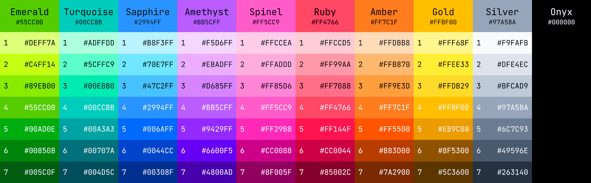

# Kwezal Color Palettes

This project consists of two elements: a _Kwezal Essential Color Palette_ in CSV format,
and a POSIX-compliant shell script that generates ready-to-use assets for apps and graphics software.

## Supported applications

- Websites and web apps (`*.css`, `*.scss`)
- Flutter apps (`*.dart`)
- GIMP, Inkscape, Krita (`*.gpl`)
- iOS/macOS apps (`Color+Extensions.swift`)
- Android apps (`colors.xml`)

## Usage

Generate all output files with:

```sh
./build
```

The generated palette files will be placed in the corresponding subdirectories of the `output` directory.

## Kwezal Essential Color Palette



A handcrafted, minimalist, general-purpose color palette containing just 64 colors.
It includes black (_Onyx_), along with nine hues, seven shades each:

- green (_Emerald_)
- teal (_Turquoise_)
- blue (_Sapphire_)
- purple (_Amethyst_)
- pink (_Spinel_)
- red (_Ruby_)
- orange (_Amber_)
- yellow (_Gold_)
- gray (_Silver_)

The palette was designed according to the following criteria:

- All colors except the gray shades should have **maximum saturation**.
- There should be **no eye-searing** colors.
- Dark text should be legible on shades 1–3, light text on shades 5–7, and both on shade 4.
- All colors should be **clearly distinguishable** from each other.
- All colors should be subjectively **attractive**. 😉

## Contributing

Contributions are welcome and appreciated 💝

Feel free to **give a star** ⭐, [open a pull request][pr], or [create an issue][issue].

## License

Kwezal Color Palettes are licensed under version 2.0 of the [Apache License][license].

[pr]: https://github.com/kwezal/kwezal-color-palettes/compare

[issue]: https://github.com/kwezal/kwezal-color-palettes/issues/new

[license]: https://www.apache.org/licenses/LICENSE-2.0